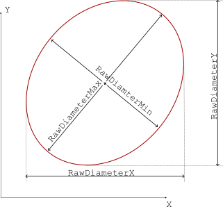

# LogSection
## Section Length and Section Center

All valid collected profiles are grouped into `LogSection`s by the `LogModelBuilder`. Sections (or slices) are spaced at a fixed interval. In `core.ini`, the entry `SectionInterval = xx` sets the spacing for the modeler. 

There is one case where a section can be longer than the interval:
If the last section would be shorter than 1/2 of the SectionInterval, the next-to-last section will be extended to contain the remaining profiles. 

Each `LogSection` has a property `SectionCenter`, denoting the z-Value of the center of the section. E.g. for a `SectionInterval` of 100mm, the first section has a center of 50mm, the second section 150mm and so on. 

!!!example "Example for a Log Length of 3040 mm"

    | Section No | Section Length | Section Center |
    | -- | -- | -- |
    | 1 | 100 mm | 50 mm |
    | 2 | 100 mm | 150 mm|
    | .. | .. | ..|
    | 30 | 140 mm |  2970 mm |
    
    In this case, the last section is extended to be 140mm long instead of 100mm.

!!!example "Example for a Log Length of 3060 mm"

    | Section No | Section Length | Section Center |
    | -- | -- | -- |
    | 1 | 100 mm | 50 mm |
    | 2 | 100 mm | 150 mm|
    | .. | .. | ..|
    | 30 | 100 mm |  2950 mm |
    | 31 | 60 mm |  3030 mm |
     
     In this case, the last section is only 60mm long. 

## Outlier Filter
LogScanner employs a heuristic model to group points into valid points and outliers. The algorithm in 
`LogSectionBuilder.FilterOutliers()` can be briefly described as a [Random Sample Consensus](https://en.wikipedia.org/wiki/Random_sample_consensus). The code picks three random points out of all points, and calculates a fitting circle. This is done `OutlierFilterMaxNumIterations` times, and all circles are kept. We then use the median circle as the most representative, and check all points against it:

For each point, we calculate the distance to the center of the median circle. The distance is always positive. We check if the point is within a specific distance from the circle (`OutlierFilterMaxDistance`) and either accept or reject the point based on that. 

## Section Validity

Each `LogSection` is tested for validity, and has a `IsValid` flag. The tests for validity can be found in `LogSectionBuilder.ValidateSection()` and contain:

 - Excessive Ovality: the ratio of maximum and minimum diameter is checked against `MaxOvality` (see `config.ini` for the default value)
 - Minimum Diameter: the calculated diameter of this section must be greater than `MinimumLogDiameter`
 - Maximum Diameter: the calculated diameter of this section must be less than `MaximumLogDiameter`
 - Position of Centroid: the centroid of the ellipse model (see below) must be within a rectangular area prescribed by `LogMinPositionX`, `LogMinPositionY`, `LogMaxPositionX` and `LogMaxPositionY`.

## Ellipse Model 
During the build phase, LogScanner calculates the best fitting ellipse through all valid points. This is done via a least squares fit algorithm. The resulting ellipse is stored as a property (`Ellipse`) within the section. As part of that fitting, the RMSE is also calculated and stored in `FitError`. The `FitError` describes, how well the section could be approximated by an ellipse.  

## LogSection Properties
Each section object  has a number of properties, calculated as part of the build. Here is a list with explanations

RawDiameterMax and RawDiameterMin
:   Length of the semimajor axis and length of the semiminor axis of the fitted ellipse, respectively. Note that this is not in X or Y direction. 

DiameterMaxAngle
:   Angle of rotation of the semimajor axis in a mathematical system, i.e. positive from the horizontal in counter-clockwise direction. 

CentroidX and CentroidY
:   Center of the modelled ellipse, in mill coordinate system. 

RawDiameterX and RawDiameterY
:   Projection of the ellipse onto the mill coordinate system axes. TBD: add illustration. 

TotalArea 
:   Area of the fitting ellipse. Calculated with the standard ellipse area formula.  